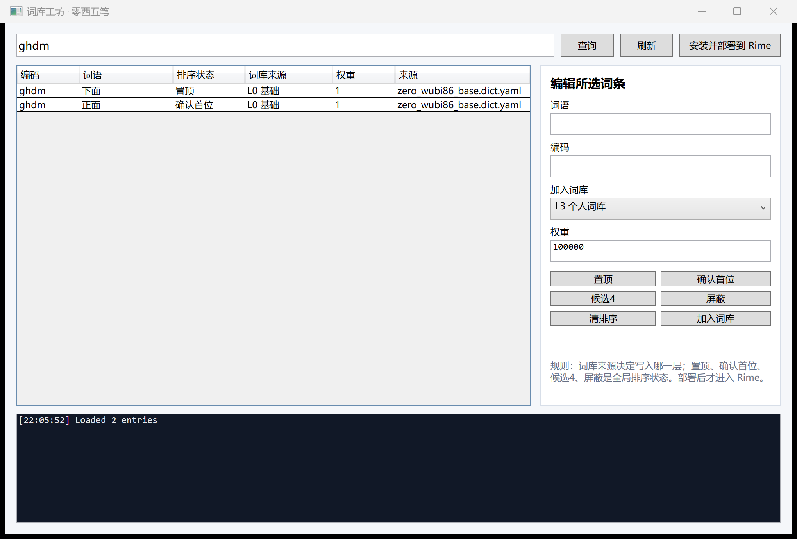
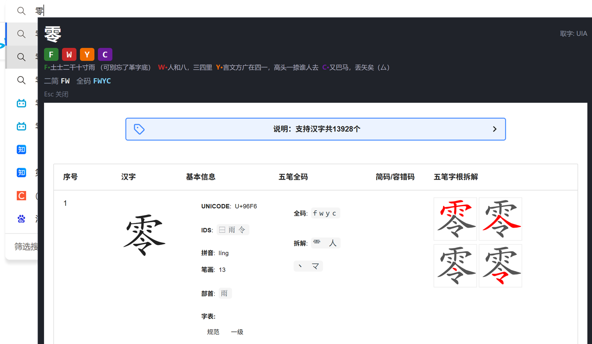

# GGTT Helper / 零西五笔工坊

> 文艺复兴：五笔 AI 时代易用性改造计划。

j=“是”  i=“不” z=无限可能

五笔不该只停留在“能打”，还应该可查、可改、可恢复、可解释。  
词库是可读数据，不是黑箱数据库；排序是明确意图，不是模糊词频漂移。  
AI 可以辅助造词、解释冲突和整理领域包，但日常输入路径必须稳定、本地、由用户掌控。

`bm.txt`、`main.py`、`main.ui`、`Ui_main.py` 等是轻量“小工具”：载入五笔码表后，可查询文字编码、筛出次二级简码和四码字，帮助整理与校对码表。

现代部分已经升级为 **零西五笔工坊**：Windows / .NET 8 / WPF 桌面工具，保留 Alt+Z 快速查拆，并增加词库工坊，用来查询同码候选、置顶、确认首位、放候选 4、屏蔽、加入词库、部署 Rime。

<p>
  
</p>
<p>
  
</p>

## 功能

- `Alt+Z` 快速查拆：读取光标左侧汉字，显示五笔编码、字根键位和常用拆字查询入口。
- 词库工坊：按词语或编码查询候选，查看编码、词语、排序状态、词库层级、权重和来源文件。
- 确定排序状态：支持置顶、确认首位、候选 4、屏蔽、清排序，不只依赖模糊词频。
- 分层词库：保留基础层，并可维护 L1 现代通用、L2 关注领域、L3 个人词库。
- Rime 部署：连接 `zeroxi-wubi` 的 Rime 源数据，安装并部署到本机 Rime。
- 轻量小工具：保留 2016 年的 PyQt4 轻量工具文件，方便追溯最早的码表整理工作。

## 下载

朋友试用可直接下载 Release 里的 Windows 最小包：

https://github.com/fofc12/GGTT_Helper/releases/latest

## 构建

```powershell
dotnet build .\ZeroXiWubiWorkshop.csproj -c Release
```

发布单文件：

```powershell
dotnet publish .\ZeroXiWubiWorkshop.csproj -c Release `
  -p:PublishSingleFile=true `
  -p:IncludeNativeLibrariesForSelfExtract=true `
  -p:SelfContained=false `
  -o .\publish
```

## 与 zeroxi-wubi 的关系

`GGTT_Helper` 是 Windows 工具插件，可以独立开发；`zeroxi-wubi` 是输入法/Rime/Next 主仓库，可以通过子模块包含本工具。

词库工坊默认会向上寻找 `zeroxi-wubi\integrations\rime\source`。如果独立运行，可以在设置里手动选择主仓库路径。

## 致谢与参考

- 五笔字型 86 版：本项目围绕王码五笔的日常输入、查拆和词库维护体验继续改造。
- 极爽五笔 6.0 / 极点时代词库：零西基础码表延续作者早年实际使用的词序与习惯，由极爽词库改造而来。
- [hantang/search-wubi](https://github.com/hantang/search-wubi) / [五笔拆解查询](https://hantang.github.io/search-wubi/)：当前在线拆字图解查询入口的主要参考与外部来源。
- [Rime 五笔字型输入方案](https://github.com/rime/rime-wubi)：Rime 生态中的五笔方案参考。


<details>
<summary>作者与支持</summary>

作者：free2ing（零西） · haoyunmail@qq.com


</details>
